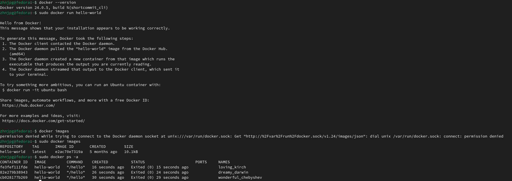
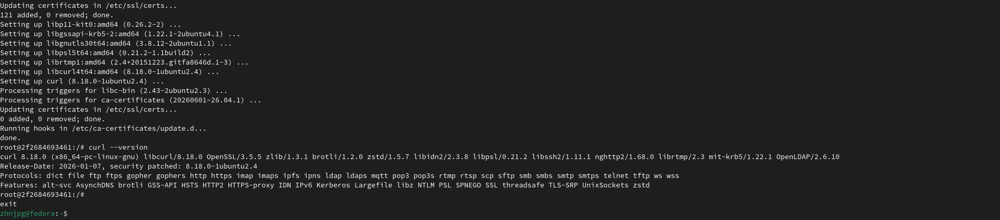
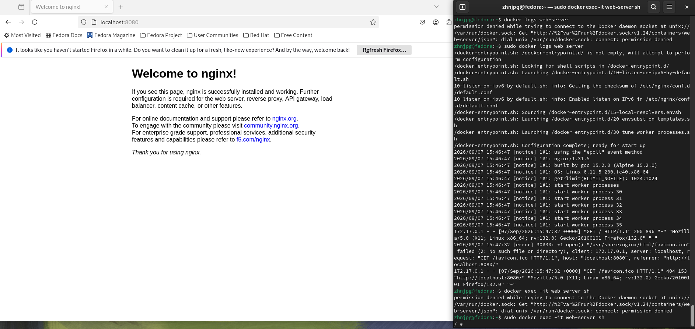
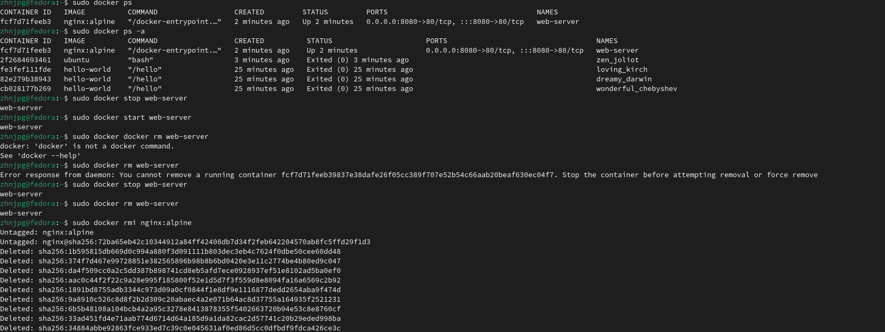
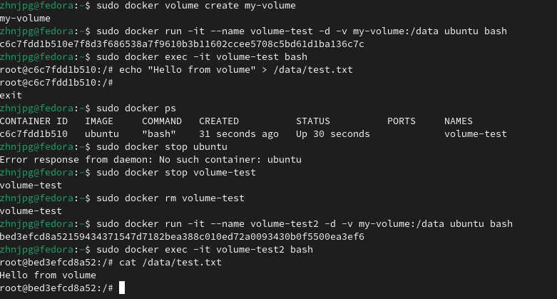

# Отчет по лабораторной работе №1 "Основы работы с Docker"

## Установка Docker

Установка Docker проводилась на ОС Fedora. После установки были выполнены базовые команды для проверки работоспосоьности

## Работа с готовыми образами

Был скачан образ Ubuntu с помощью команды docker pull, после чего произведен вход в терминал образа и установлен curl

## Запуск веб-сервера

Командой docker run был установлен, а после запущен образ nginx:alpine, с аргументами для проброса портов, после чего произведена проверка его работоспособности

## Управление контейнерами

В соответствии с указаниями лабораторной был выполнен набор команд для управления контейнерами: вывод доступных контейнеров, запуск, остановка, удаление контейнера и удаление образа (работающее только с остановленным образом)

## Работа с томами

Был создан том, после чего он был указан в аргументах запуска контейнера. В данный том был записан файл, после чего контейнер удален и создан новый с тем же томом, в результате чего записанные данные были доступны на новом контейнере

