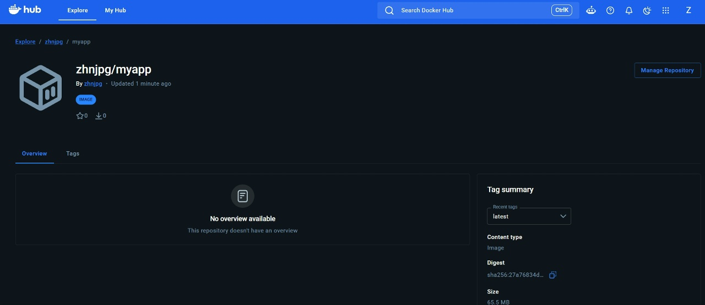

# Отчет по лабораторной работе №2 "CI/CD для Docker приложения"

## Подготовка проекта:

Был создан аккаунт на dockerhub, а так же создан отдельный репозиторий под лабораторную доступный по ссылке https://github.com/zhnjpg/dockerhub_lab

## Настройка GitHub Actions

Был создан файл .github/workflows/docker-build.yml настраивающий пайплайн для сборки и выкладки докер образа

```yml
name: Docker Build and Push

on:
  push:
    branches:
      - main

jobs:
  build-and-push:
    runs-on: ubuntu-latest

    steps:
      - name: Checkout code
        uses: actions/checkout@v4

      - name: Set up Docker Buildx
        uses: docker/setup-buildx-action@v3

      - name: Login to Docker Hub
        uses: docker/login-action@v3
        with:
          username: ${{ secrets.DOCKER_USERNAME }}
          password: ${{ secrets.DOCKER_PASSWORD }}

      - name: Build and push Docker image
        uses: docker/build-push-action@v5
        with:
          context: .
          push: true
          tags: zhnjpg/myapp:latest

      - name: Deploy
        run: echo "Deploying application..."
```


## Настройка секретов

В гитхаб репозиторий были добавлены имя пользователя и токен докерхаба

## Тестирование пайплайна

После коммита и пуша в ветку пайплайн автоматически запустился, после чего докер образ стал доступен на докерхабе:



Логи пайплайна приложены в этой же директории.