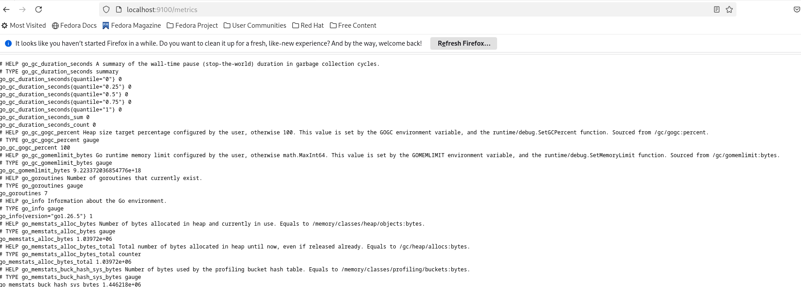
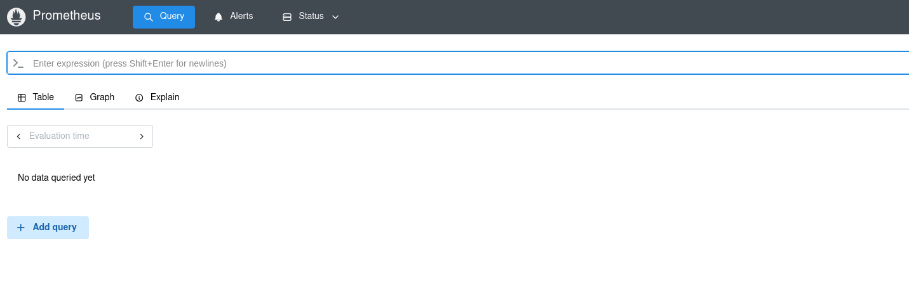
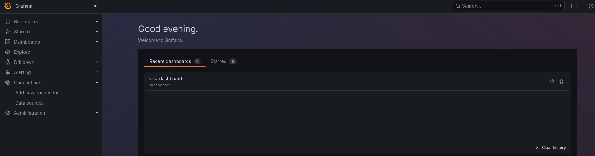
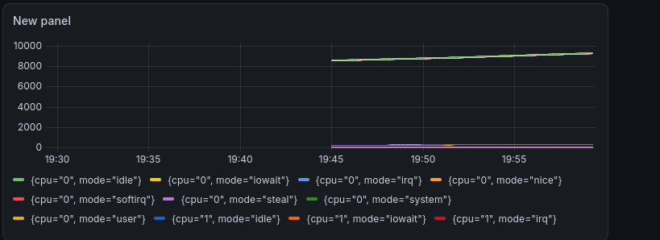
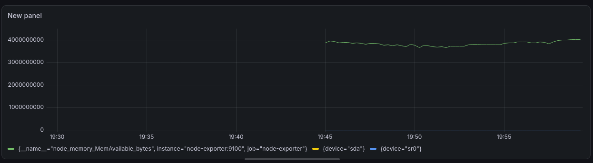

# Отчет по лабораторной работе №3 "Мониторинг с Prometheus и Grafana"

## Настройка мониторинга с Prometheus и Grafana:

Был создан файл prometheus.yml в соответствии с указаниями:

```yml
global:
  scrape_interval: 15s

scrape_configs:
  - job_name: 'prometheus'
    static_configs:
      - targets: ['localhost:9090']

  - job_name: 'node-exporter'
    static_configs:
      - targets: ['node-exporter:9100']
```


## Запуск Node Exporter

Был запущен контейнер node-exporter:


## Запуск Prometheus

Была настроена среда выполнения для запуска контейнера prometheus

В процессе запуска была обнаружена ошибка о недостатке прав для чтения конфиг файла prometheus, для простого исрправления были выданы все права (777) на файл и папку с конфигом, а так же контейнер был перезапущен с флагом :z (-v $(pwd)/prometheus:/etc/prometheus:z) для работы с SELinux



## Запуск Grafana



## Настройка Grafana

В процессе настройки возникла проблема с подключением к контейнеру Prometheus, что было исправлено сменой localhost на айпи из docker network

Была добавлена метрика node_cpu_seconds_total, представленная на скриншоте ниже



А так же метрики node_memory_MemAvailable_bytes и node_disk_io_time_seconds_total, для удобства демонстрации которых метрика node_cpu_seconds_total была скрыта

